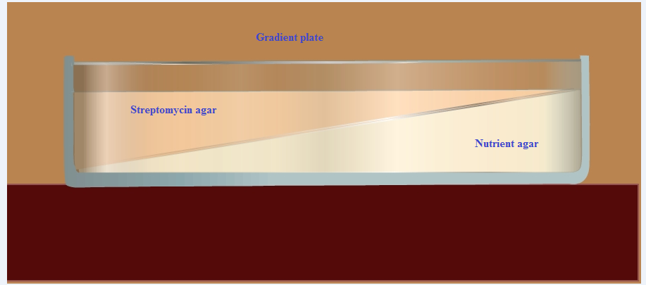
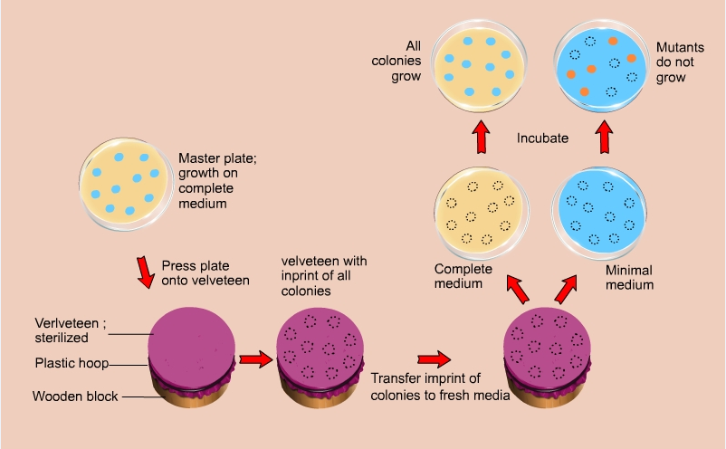

### Principle:

&nbsp;

Mutation is a heritable change in the nucleotide sequence of DNA. Mutations may be characterized according to either the kind of genotypic change that has occurred or their phenotypic consequences. Mutations can alter the phenotype of a microorganism in several different ways. Morphological mutations change the microorganism’s colonial or cellular morphology. Nutritional or biochemical variation may occur in a gene that encodes an enzyme involved in a metabolic pathway of amino acid synthesis. Changes in gene regulation occurs when mutation occur in a gene encoding a transcription factor. Lethal mutations prevent the reproducing capability of the organism, and when expressed, it results in the death of the microorganism.

&nbsp;

Mutations often inactivate a biosynthetic pathway of the microorganism, and frequently make a microorganism unable to grow on a medium lacking an adequate supply of the pathway’s end product. Based on this principle microorganism are classified as Prototrophic and Auxotrophic. Prototrophic organisms (wild type) have the same nutritional requirements as that of their ancestors. They need only inorganic salts, an organic energy source such as sugar, fat, protein and water to survive and grow. That is, the Prototroph’s need only "Minimal medium" for their growth and survival. Auxotrophic mutants are unable to grow without one or more essential nutrients. Auxotrophs are mutant for particular nutrient synthesis pathway enzymes. Such an error is known as an inborn error of metabolism, whether it occurs in a bacterium or a eukaryote. An auxotroph can be grown only on an enriched medium that provides the particular nutrient that the mutant cannot metabolize on its own.

&nbsp;

There are two classes of mutations: Spontaneous mutations and induced mutations.
 
### Spontaneous Mutations:
 

A mutation without a known cause is called Spontaneous mutations. This occurs at low frequency leading to the chemical instability of purine and pyrimidine bases and also due to low level of metabolic errors, or mistakes during the DNA replication.

&nbsp;

### Induced Mutations:
 

Mutations that results from exposure of organisms to mutagenic agents such as ionizing irradiation, ultraviolet light or various chemicals that react with nucleic acids. In experimental organisms, researchers often treat them with these mutagens in order to increase the frequency of mutation in them.

&nbsp;
 

Generally, chemical mutagens induce point mutations, whereas ionizing radiations gives rise to large chromosomal abnormalities. Point mutations are simple changes in single base-pairs, the substitution of one base-pair for another, or duplication or deletion of single base-pairs. Point mutations occur at a single point on a chromosome. Missense mutation is a type of point mutation, in which a single nucleotide is changed that leads to substitution of a different amino acid and a nonsense mutation, is a point mutation, that changes a normal codon into a stop codon that does not code for an amino acid and arrest peptide synthesis without amino acid insertion resulting in a non functional protein product.

&nbsp;
 

Frame shift mutation, is a kind of mutation caused by the addition or deletion of nucleotides which is not a multiple of three so that the codon is read incorrectly during translation. A silent mutation causes base substitution without amino acid substitution and thus has no effect. Such substitutions will not cause any change in their product and cannot be detected without genome sequencing. In any case, the mutation events are often reversible. The subsequent mutations in the nucleotide pair restore the original wild type phenotype. That is, a gene that has undergone mutation reverses to its original base composition. This is referred to as back-mutation, reverse mutation or reversion.
 
&nbsp;

Genetic and biochemical investigations in bacteriology are often initiated by isolation of mutant strains. The spontaneous mutations due to resistance in antibiotics such as Streptomycin are easily detected because they grow in the presence of antibiotic concentrations that inhibit the growth of normal bacteria.

### Gradient Plate Technique:
 
An excellent way to determine the ability of organisms to produce mutants that are resistant to antibiotic is to grow them on a gradient plate of a particular antibiotic. The gradient plate consists of two wedges like layers of media: a bottom layer of plain nutrient agar and top layer of antibiotic with nutrient agar. The antibiotic in the top layer, diffuse into the bottom layer producing a gradient of antibiotic concentration from low to high.  A gradient plate is made by using Streptomycin in the medium. E. coli, which is normally sensitive to Streptomycin, will be spread over the surface of the plate and incubated for 24 to 72 hours. After incubation colonies will appear on both the gradients. The colonies develop in the high concentration are resistant to the action of Streptomycin, and are considered as Streptomycin resistant mutants. For isolation of antibiotic resistant of gram negative enteric bacteria, the antibiotics commonly used are Rifampicin, Streptomycin, and Erythromycin etc.

&nbsp;

 Fig 1: Gradient plate preparation steps
 
 &nbsp;
 
### Replica Plating Method:

If an organism has the ability to produce mutant strains resistant to antibiotics, the nature of mutation, whether it is spontaneous or induced have to be tested.  It would be a difficult task to identify a few mutant colonies from a vast population of 100-500 colonies. This can be accomplished by a replica plating technique. The technique was developed by Joshua and Esther Lederberg in 1952 for providing the direct evidence for the existence of pre-existing mutations. This technique isolates both nutritional mutants and antibiotic resistant mutants. Their actual experiment concerned with replicating master plates of sensitive cells to two or more plates containing either streptomycin or T1 phage.

 &nbsp;
 
Replica plating allows the observation of microbes under a series of growth conditions. The bacteria are grown in an environment that is not selective for given mutation.  This technique is used to transfer the members of each colony to a selective environment. A simple velveteen covered colony transfer device is used to transfer the colonies in nutrient agar medium supplemented with or without a particular antibiotic or nutrient.  The fibers of velvet act as fine inoculating needles, picking up the bacterial cells from the surface of this master plate. The velvet with its attached microbes is then touched to the surface of a sterile agar plate, inoculating it. In this manner, microbes can be repeatedly stamped onto media of differing composition. By comparing the presence of colonies following incubation we can indirectly determine the mutant colonies by their absence in the selective environment. A colony that develops on a complete medium fail to develop on a minimal medium that lacks a specific growth factor, the occurrence of a nutritional mutant is indicated. The microbes that do not grow on the minimal medium represent auxotrophic strains. A simple velveteen covered colony transfer device is used to transfer the colonies in nutrient agar medium supplemented with or without a particular antibiotic or nutrient. A colony that develops on a complete medium fail to develop on a minimal medium that lacks a specific growth factor, the occurrence of a nutritional mutant is indicated. The microbes that do not grow on the minimal medium represent auxotrophic strains. This method has been applied in numerous experiments to identify the occurrence of mutations. Many of the biochemical pathways in microbes were elucidated in this way by using nutritional mutants (Fig 2).

Fig 2: Replica plating technique
